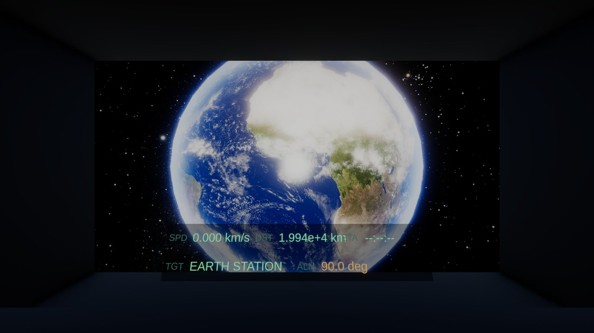
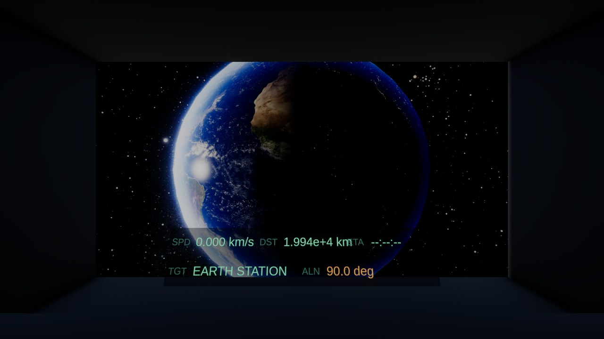
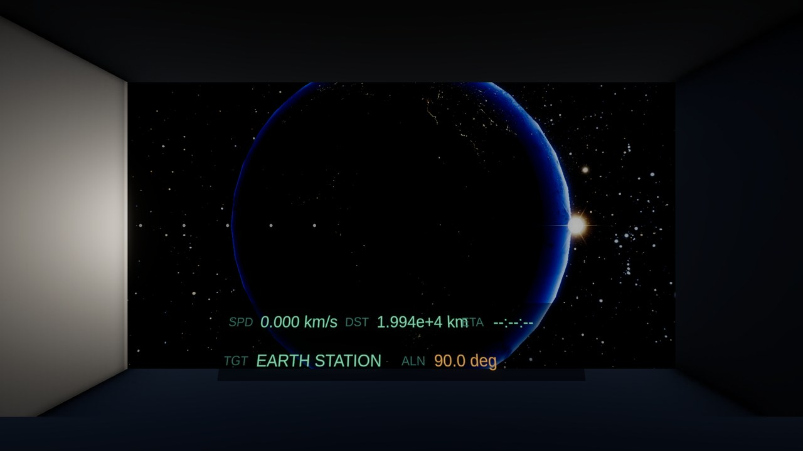
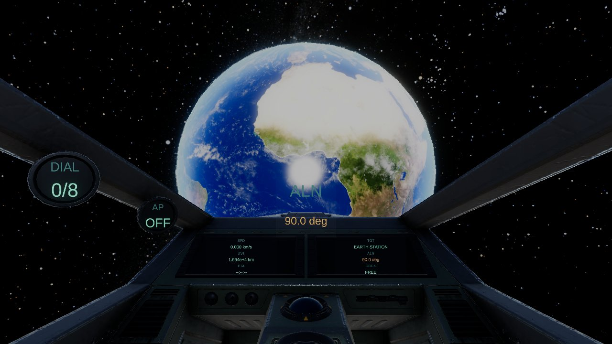
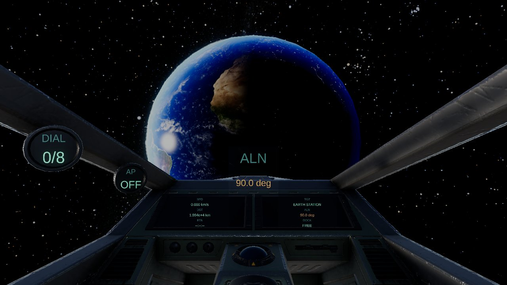
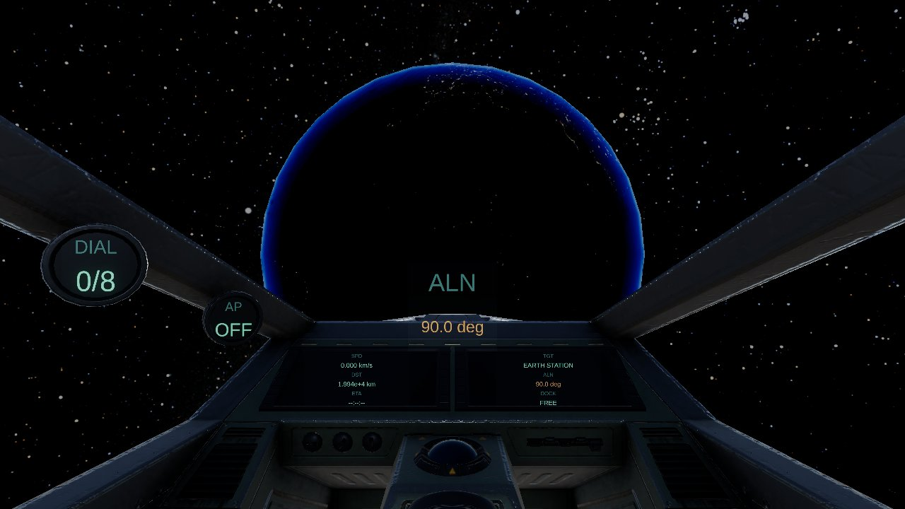

# solar-system-explorer

Unity 6 / URP で作っている、太陽系をゆっくり眺めるための**個人用の最小デモ**です。
地球ステーションから火星ステーションまで飛んで、ドッキングして、戻ってくる。それだけ。
ゲーム性はありません。公開・配布・販売を目的にしたものではなく、
requirements に沿って Step を刻みながら作った学習・実験用のリポジトリです。

1 unit = 1 km。天体の絶対座標は `double` で持ち、毎フレーム原点を船に据え直す
(フローティングオリジン) ことで、海王星軌道スケールでも `float` の精度落ちを避けています。

---

## 遊び方

**ビルド済みの実行ファイルは配布していません** (`build/` は `.gitignore` 済み)。
Unity Editor で開いて Play してください。

### 必要なもの

| | |
| --- | --- |
| Unity Editor | **6000.3.11f1** (URP 17.3.0) |
| OS | Windows 11 で開発・検証。他は未確認 |

### 手順

1. このリポジトリを clone する。

2. **テクスチャの原本を `source_assets/` に置く。**
   `source_assets/` は `.gitignore` 済みなので clone しても入ってきません。
   入手元・ファイル名・解像度は [docs/02-assets.md](docs/02-assets.md) にあります。
   必要なのは次の 4 つです。

   ```
   source_assets/starmap_2020_4k.exr
   source_assets/8k_earth_daymap.jpg
   source_assets/8k_mars.jpg
   source_assets/8k_sun.jpg
   ```

   > `unity/Assets/Textures/` に取り込み済みの複製は追跡してあるので、
   > **Editor で開くだけなら 2 は省けます。** 取り込み直したいときや、
   > 原本を差し替えたいときにだけ必要です。

3. `unity/` を Unity Editor で開く。

4. シーンを生成する。**GUI の Editor を閉じてから**回してください
   (batchmode とプロジェクトロックが競合します)。

   ```powershell
   .\tools\run_unity.ps1 -Method SolarSetup.ImportTmp        # TextMeshPro の Essential Resources
   .\tools\run_unity.ps1 -Method SolarSetup.ImportTextures   # source_assets/ -> Assets/Textures/
   .\tools\run_unity.ps1 -Method SolarSetup.Run              # Assets/Scenes/Main.unity を生成
   ```

   ドメインリロードを跨ぐので **3 回に分けて実行します。**

5. Editor で `Assets/Scenes/Main.unity` を開いて Play。

### テストとビルド

```powershell
.\tools\run_tests.ps1                                    # EditMode  108 件
.\tools\run_tests.ps1 -TestPlatform PlayMode             # PlayMode   31 件
.\tools\run_unity.ps1 -Method SolarSetup.Build -TimeoutMinutes 30   # build/ へ Windows ビルド
```

---

## 操作

視点はコックピット固定です。姿勢を変えるとコックピットごと回ります。

| キー | 動作 |
| --- | --- |
| マウス移動 | ピッチ / ヨー |
| `W` `A` `S` `D` | ピッチ / ヨー (キーボード) |
| `Q` `E` | ロール |
| `Space` | 前進 (スラスト) |
| `R` `F` | 速度ダイヤルを上げる / 下げる |
| `Tab` | 目標ステーションを切り替える |
| `T` | オートパイロット起動 |
| `G` | オートパイロット解除 |
| `Enter` | ドッキング要求 |
| `BackSpace` | 出港 |
| `1`〜`8` | デバッグジャンプ (火星までの距離を指定して飛ぶ) |

### 速度ダイヤル (`R` / `F`)

9 段。低速側は km/s 表記、高速側は c 表記です。手動操作の上限は 1 km/s。

```
STOP  →  10 m/s  →  100 m/s  →  1 km/s  →  0.001c  →  0.01c  →  0.1c  →  0.5c  →  0.9c
```

### デバッグジャンプ (`1`〜`8`)

火星までの距離を指定して瞬間移動します。光点からメッシュへの切り替わりを目で追うためのものです。

| キー | 火星までの距離 |
| --- | --- |
| `1` | 1.0e7 units |
| `2` | 1.0e6 units |
| `3` | 1.0e5 units |
| `4` | 5.0e4 units |
| `5` | 2.0e4 units |
| `6` | 1.0e4 units |
| `7` | 5.0e3 units |
| `8` | 4.0e3 units |

### 計器

画面下端に 2 行。速度 (SPD) / 目標までの距離 (DST) / 到着予定 (ETA) /
目標名 (TGT) / ポート正面からのずれ角 (ALN)。
ずれ角が許容 30 度以内に入ると `ALIGNED` が付きます。
`Enter` を押して要求が通らなかったときは、距離・速度・角度のどれが足りないかが 1 行で出ます。

### セーブ

ドッキングしたときに、そのステーション名だけを JSON で保存します。
次に起動するとそこから始まります。ファイルが無い / 壊れている / 知らない名前のときは
地球ステーションから始まります。

```
%USERPROFILE%\AppData\LocalLow\<Company>\<Product>\solar-system-explorer.save.json
```

---

## クレジット

このリポジトリには**テクスチャ本体を含んでいます** (`unity/Assets/Textures/`)。
再配布にあたるため、以下の表記はライセンス上の必須事項です。

### 惑星・太陽のテクスチャ

**Solar System Scope** — <https://www.solarsystemscope.com/textures/>
**Licensed under CC BY 4.0** — <https://creativecommons.org/licenses/by/4.0/>

使用ファイル（Demo 2 で 4 枚追加。**取り込み時に 4k へ縮小したものも含めて再配布にあたる**）:

| ファイル | 解像度 | 用途 |
| --- | --- | --- |
| `8k_earth_daymap.jpg` | 8192 x 4096 | 地球のアルベド |
| `4k_earth_clouds.jpg` | 4096 x 2048 | 地球の雲層（Demo 2） |
| `4k_earth_nightmap.jpg` | 4096 x 2048 | 地球の夜側の街灯り（Demo 2） |
| `4k_earth_normal.png` | 4096 x 2048 | 地球の法線（Demo 2） |
| `4k_earth_specular.png` | 4096 x 2048 | 海の鏡面マスク（Demo 2） |
| `8k_mars.jpg` | 8192 x 4096 | 火星のアルベド |
| `8k_sun.jpg` | 4096 x 2048 | 太陽の表面 |

> `4k_*` は Solar System Scope の 8k 版を**このリポジトリで縮小したもの**です。
> CC BY 4.0 は改変を許可していますが、**改変した旨の明示**が条件に含まれるため
> ここに記載しています。元データの出所・ライセンスは上と同じです。

`sun_corona.png` と `flare_streak.png` は**このリポジトリがコードで生成したもの**で、
外部素材ではありません（`Editor/CoronaTextureBuilder.cs` / `Editor/FlareTextureBuilder.cs`）。

### 効果音 (Demo 2 で追加)

**Kenney** — <https://kenney.nl/>
**Licensed under CC0 1.0 (Public Domain Dedication)** — <https://creativecommons.org/publicdomain/zero/1.0/>

CC0 なのでクレジット表記は**必須ではありません**が、出所として記載します。

| ファイル | 元素材 | パック |
| --- | --- | --- |
| `engine_loop.wav` | `spaceEngineLow_003.ogg` | Sci-Fi Sounds |
| `cockpit_loop.wav` | `forceField_000.ogg` | Sci-Fi Sounds |
| `dock_impact.ogg` | `impactPlate_heavy_001.ogg` | Impact Sounds |
| `undock.ogg` | `switch_004.ogg` | Interface Sounds |
| `ui_select.ogg` | `select_001.ogg` | Interface Sounds |
| `ui_confirm.ogg` | `confirmation_003.ogg` | Interface Sounds |
| `warning.ogg` | `error_008.ogg` | Interface Sounds |

> `engine_loop.wav` と `cockpit_loop.wav` は**ループ用に加工したもの**です。
> 加工は `Editor/AudioLoopBuilder.cs` が行い、パラメータと加工後の実測値は
> [docs/audio-candidates.md](docs/audio-candidates.md) に記録しています。
> 他の 5 本は原本のままです。

---

### コックピットモデル (Demo 3)

| | |
| --- | --- |
| アセット | Hi-Rez Spaceships Creator Free Sample（v1.31） |
| 提供元 | Ebal Studios（Unity Asset Store / 無料） |
| 使っているもの | 内装付きコックピット `Cockpit3_WithInterior` のみ |

**リポジトリにはアセット本体が入っていません。**
取り込んだアセットは **Standard Unity Asset Store EULA** に基づいて使用します。
EULA は**アセット自体の再配布を禁じている**ため、**このリポジトリには含めません**
（`unity/Assets/ThirdParty/` は追跡除外）。
clone しただけの環境では**箱コックピットにフォールバック**します。

入手手順と取り込み先は [docs/asset-sources.md](docs/asset-sources.md) §4 にあります。

---

### ステーションモデル (Demo 4)

| | |
| --- | --- |
| アセット | Space Station Free 3D Asset (HDRP + URP + Built-In)（v1.2） |
| 提供元 | Cobble Games（Unity Asset Store / 無料） |
| 使っているもの | 13-2 の棚卸しで確定 |

**リポジトリにはアセット本体が入っていません。**
取り込んだアセットは **Standard Unity Asset Store EULA** に基づいて使用します。
EULA は**アセット自体の再配布を禁じている**ため、**このリポジトリには含めません**
（`unity/Assets/ThirdParty/` は追跡除外）。

入手手順と取り込み先は [docs/asset-sources.md](docs/asset-sources.md) §5 にあります。

---

### 星空 (スカイボックス)

**NASA/Goddard Space Flight Center Scientific Visualization Studio**
*Deep Star Maps 2020* — <https://svs.gsfc.nasa.gov/4851>

SVS のページが指定するクレジット文言:

> NASA/Goddard Space Flight Center Scientific Visualization Studio.
> Gaia DR2: ESA/Gaia/DPAC.
> Constellation figures based on those developed for the IAU by Alan MacRobert of
> Sky and Telescope magazine (Roger Sinnott and Rick Fienberg).

- Animator / Visualizer: **Ernie Wright** (USRA)
- Technical Support: Laurence Schuler (ADNET Systems, Inc.), Ian Jones (ADNET Systems, Inc.)

使用ファイル: `starmap_2020_4k.exr` (celestial, 4096 x 2048。Unity 側で Cubemap 化して 2048 px/面)

元データは **Hipparcos-2 / Tycho-2 / Gaia Data Release 2** に加え、
Yale Bright Star Catalog / UCAC3 / XHIP に由来します。

> 本デモが使っているのは星のみの *celestial* 版で、星座線入りの版ではありません。
> 上のクレジット文言は SVS ページの指定をそのまま引いたものです。

NASA の画像は一般にパブリックドメイン扱いですが、
Gaia (ESA) など第三者のデータを含みます。詳細は [docs/02-assets.md](docs/02-assets.md) を参照してください。

---

## 実装状況

**最小デモ（Step 0〜7）と Demo 2（Step 8〜10）が完了**しています。
各 Step の完了時点に git タグを打ってあります
(`step-0` 〜 `step-7` / `v0.1-minimal-demo`、`step8-0` 〜 `step10-4` / `demo2`)。

| Step | 内容 |
| --- | --- |
| 0 | スキャフォールド (batchmode ラッパー、asmdef 4 枚、CLAUDE.md) |
| 1 | フローティングオリジン |
| 2 | 太陽系プレースホルダー (プロキシ殻、角直径による切替) |
| 3a | 手動操作 (速度ダイヤル、姿勢、デバッグジャンプ) |
| 3b | オートパイロットと実スケール引き渡し |
| 4 | コックピットと計器 (RenderTexture + TextMeshPro) |
| 5 | ステーションとドッキング |
| 6 | 見た目の仕上げ (星空、惑星テクスチャ、ポストプロセス、エンジン音) |
| 7 | セーブ、計器レイアウトの改修、スタンドアロンビルド |

### Demo 2（見た目デモ）

新機能は足さず、**画面に映るものと聴こえるものを本物へ置き換え**ました。

| Step | 内容 |
| --- | --- |
| 8-0 | F1 デバッグ HUD のトグル、コックピットの微振動、検証ハーネス（シナリオ 18 件） |
| 8-0b | **F4 デバッグパネル** — 実機で「目と耳で決めるしかない値」を振るための操作盤 |
| 8-1 / 8-2 | 4k テクスチャの取り込み、**手書きの惑星シェーダ**（法線・海の鏡面・夜側の街灯り・大気の縁） |
| 8-3 / 8-4 | 雲層、自転（等倍。ETA と時計を共有するため誇張しない） |
| 8-5 | プロキシ殻と実スケールメッシュの整合（引き渡し帯での二重像・位相ずれの解消） |
| 9-1 | 太陽の HDR 化（**手書きの太陽シェーダ**、周辺減光） |
| 9-2 | コロナ（ビルボード 1 枚、プロシージャル生成） |
| 9-3 | レンズフレア（**深度を使わない解析的な遮蔽判定** + 光条・水平の縞・ゴースト） |
| 9-4 | bloom と露出の再調整（**Step 6 以来 bloom が実行時に効いていなかったのを修正**） |
| 10 | 音（ループ 2 本 + イベント音 5 種、グループ音量、ドッキングでのローパス遷移） |

計画と決定値の一覧は [docs/02-demo2-plan.md](docs/02-demo2-plan.md) §0-A にあります。
**実機で目と耳で決めた値**がどれかも、そこに分けて書いてあります。

### Demo 2 の代表カット

| | |
| --- | --- |
|  | 4k テクスチャ・雲層・大気の縁 |
|  | 夜側の街灯り・海の鏡面反射 |
|  | HDR ディスク・コロナ・光条 |

### Demo 3（コックピット）

灰色の箱で組んでいたコックピットを、**公開アセットの内装付き 3D モデル**へ置き換えました。
アセットは Ebal Studios の無料サンプル（Hi-Rez Spaceships Creator Free Sample / v1.31）。
**EULA のためアセット本体はこのリポジトリに入っていません**（`unity/Assets/ThirdParty/` は追跡除外）。
取り込まれていないクローンでは**箱コックピットへ自動で落ちます**（判定はプレハブ GUID の有無）。

| Step | 内容 |
| --- | --- |
| 11-0 | 追跡除外・出典記録・フォールバック骨格（**取り込み前に**追跡除外を入れる） |
| 11-1 | `.unitypackage` の取り込み（CLI に閉じる）、URP 変換、マテリアルの棚卸し |
| 11-2 | 配置・スケール・視点。**姿勢は前方と上方の 2 軸で決める**（1 軸だと前後と上下が同時に反転する） |
| 11-3 | 計器を**コックピットの 5 面へ移設**（面ごとに Render Texture、下端の帯は撤去） |
| 11-3c | **逆歪ませ** — 傾いた面の遠近を、RT の中身を先に歪ませて打ち消す（4 点 DLT で自動算出） |
| 11-4 | 内装の補助光（暗い場面で真っ黒に潰れないようにするだけの弱い点光源） |
| 11-5 | **有料アセットは買わず、無料のまま続けると決定** |

計画と決定値の一覧は [docs/03-demo3-plan.md](docs/03-demo3-plan.md) §0-A にあります。

**計器の見せ方は 3 択（面に貼る / 正対 / 逆歪ませ）を F4 に残してあります。**
逆歪ませは片目・平面モニタ専用の細工なので、**PCVR では「面に貼る」へ戻します**
（両眼視差があると、傾いた盤は傾いた盤として正しく見えるため）。

### Demo 3 の代表カット

| | |
| --- | --- |
|  | 計器が読める（面ごとの RT・逆歪ませ・下端の帯は無い） |
|  | 明暗境界。内装に光が差す |
|  | 暗い場面。補助光で内装が潰れていない |

船の乗り換え・相対論効果の描画・惑星への着陸・PCVR 対応・戦闘などは
**スコープ外**です。理由は [docs/00-requirements.md](docs/00-requirements.md) §4 を参照してください。

### ドキュメント

| ファイル | 内容 |
| --- | --- |
| [docs/00-requirements.md](docs/00-requirements.md) | 要件 (凍結。変更は追記のみ) |
| [docs/01-architecture.md](docs/01-architecture.md) | 設計と決定 D-1 〜 D-25 |
| [docs/02-assets.md](docs/02-assets.md) | 外部アセットの出所とライセンス |
| [docs/02-demo2-plan.md](docs/02-demo2-plan.md) | Demo 2 の計画・完了状態・決定値の一覧 |
| [docs/03-demo3-plan.md](docs/03-demo3-plan.md) | Demo 3 の計画・完了状態・決定値の一覧 |
| [docs/asset-sources.md](docs/asset-sources.md) | Demo 2 で追加した素材の出所とライセンス |
| [docs/audio-candidates.md](docs/audio-candidates.md) | 音の選定経緯とループ加工のパラメータ |
| [CLAUDE.md](CLAUDE.md) | 開発時の運用ルール・コマンド |
