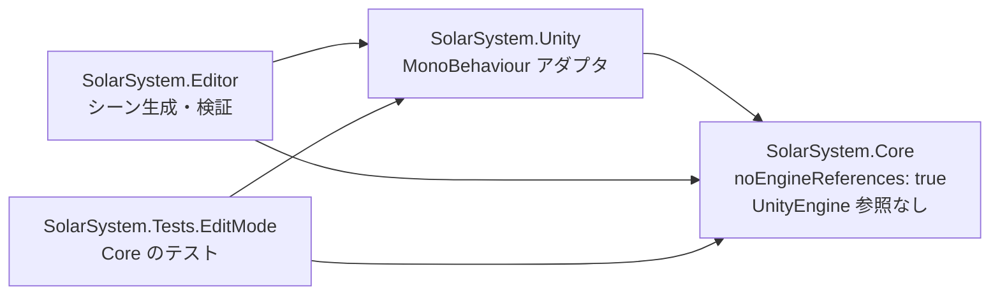
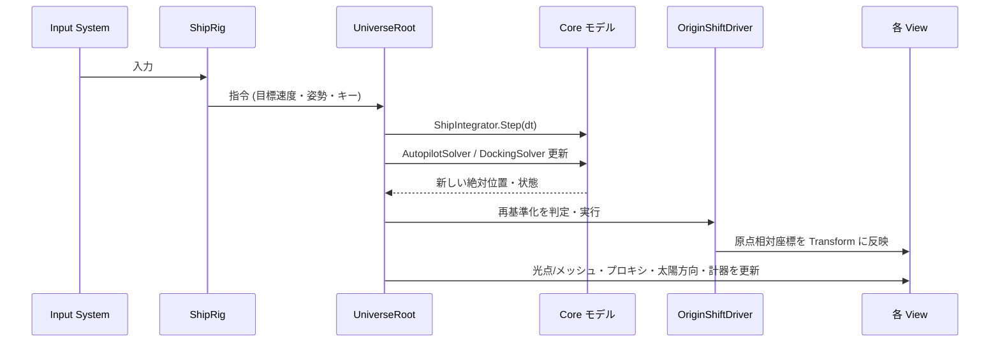
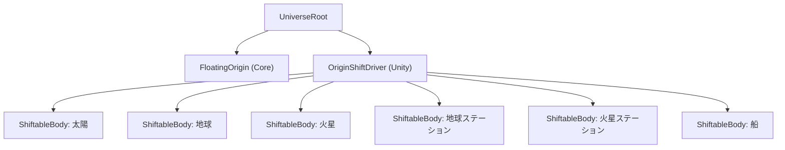
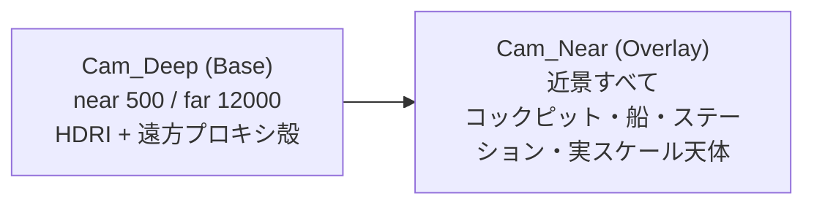
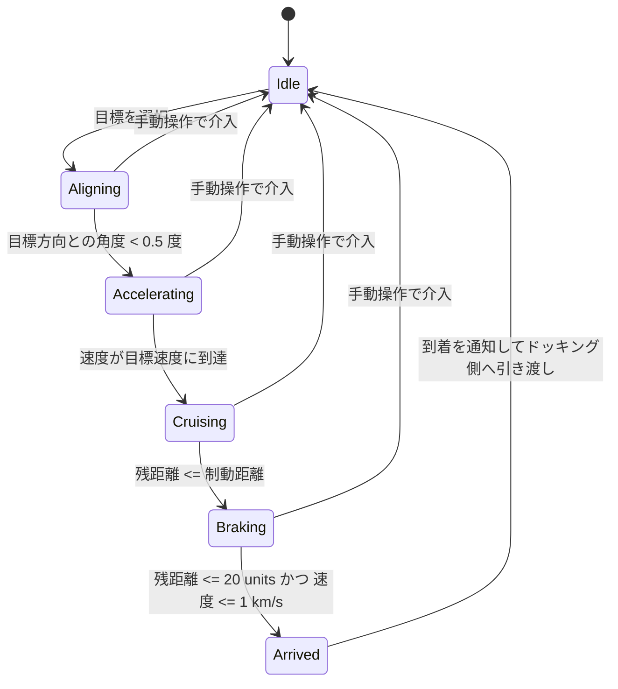
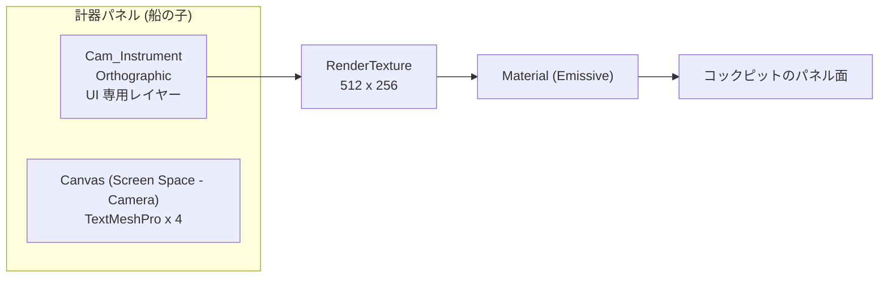
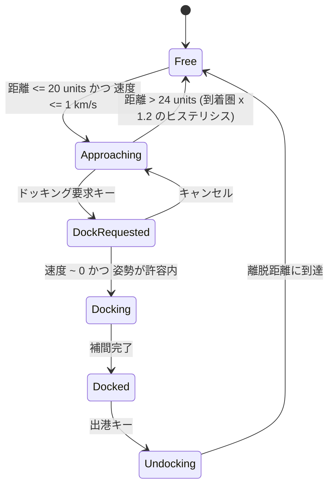
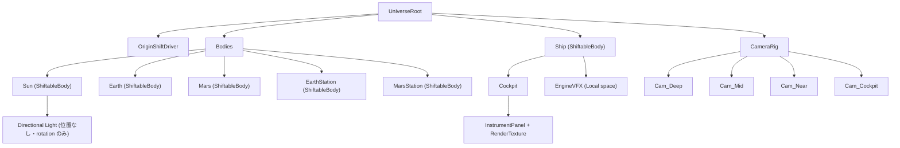
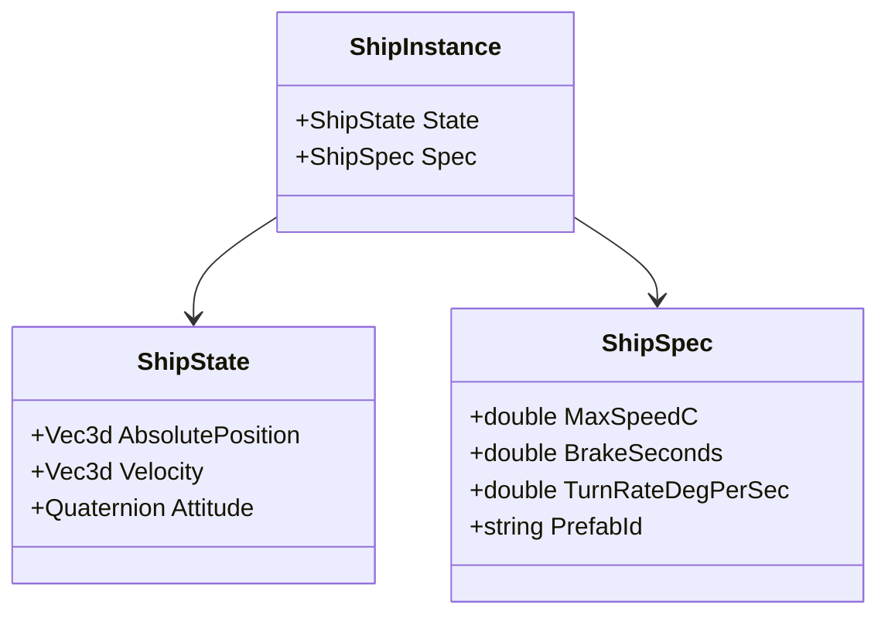

# 01 — 最小デモの技術設計

`docs/00-requirements.md` §6 の 1〜10 に対応する設計。実装コードは含まない。

- 章立ては要件書 §6 の項目順。
- 判断が分かれた箇所は **2026-08-26 に全件確定済み**。各章末の「決定」表と §11 の索引が正。
  ID は `D-1` から `D-25`。
- **要件書は凍結（追記のみ）。** 要件と設計が食い違う箇所は
  §0 と各章の「要件からの逸脱」に理由付きで書く。

---

## 0. 要件書の矛盾・実現不能点

設計に入る前に、`00-requirements.md` の記述で**そのままでは成立しない点**を挙げる。

### 0-1. 【矛盾】Step 3 の完了条件と既定巡航速度 0.1c

要件 §5 は Step 3 の完了条件を「火星を選択→放置で**数分後**に到着圏内」とし、
§3 は既定巡航速度を **0.1c**、§3「移動時間」を**等倍時間で待つ**としている。

地球〜火星 7.8e7 units（= 7.8e7 km）を等倍で飛ぶと:

| 速度 | km/s | 所要時間 |
| --- | --- | --- |
| 0.1c（既定） | 29,979.25 | **43 分 21 秒** |
| 0.25c | 74,948.11 | 17 分 20 秒 |
| 0.5c | 149,896.23 | 8 分 40 秒 |
| 0.75c | 224,844.34 | 5 分 46 秒 |
| 1.0c（最大） | 299,792.46 | 4 分 20 秒 |

**「数分」と呼べるのは 0.75c 以上。既定の 0.1c では 43 分かかる。**

**決定（D-8）: 既定巡航速度を 0.9c とする（実距離で 4 分 49 秒）。**
さらに **Step 3 の到着テストは実距離ではなく 1/1000 スケールの仮目標地点
（7.8e4 units）で行う**。0.9c なら **0.289 秒**で到着するので、
オートパイロットの状態遷移を高速に反復検証できる。
惑星の配置は実距離のまま動かさないので、「リアル寄り」（要件 §1）と
角直径の実測一致（§3-2）は保たれる。

### 0-2. 【実現不能】Trigger 進入でドッキングを開始する仕様

要件 §4 は「ステーション … とドッキング（**Trigger 進入**→要求表示→…）」としている。
しかし巡航速度では 1 フレームの移動量が Trigger より桁違いに大きい。

| 速度 | 60fps での 1 フレーム移動量 | 半径 5 units の Trigger を |
| --- | --- | --- |
| 0.1c | 499.7 units | **100 倍**飛び越す |
| 1.0c | 4,996.5 units | **999 倍**飛び越す |

PhysX の Trigger は離散判定なので、巡航中は**必ずすり抜ける**。
→ ドッキング状態機械の遷移判定は Core 側の **double による解析的な距離判定**で行い、
Unity の Trigger は「十分減速したあとの近接確認」にだけ使う。
詳細は §6。**この点は要件からの逸脱**であり、理由は上表のとおり。

### 0-3. 【将来の矛盾】最大速度 1.0c と「あとから相対論効果を足す」拡張ポイント

要件 §3 は最大巡航速度 **1.0c**、相対論的効果は「今回は実装しないが
**あとから視覚シェーダとして追加できる構造にしておく**」としている。
しかしローレンツ因子 γ = 1/√(1−(v/c)²) は:

| v | γ |
| --- | --- |
| 0.1c | 1.0050 |
| 0.5c | 1.1547 |
| 0.9c | 2.2942 |
| 0.99c | 7.0888 |
| 0.999c | 22.3663 |
| **1.0c** | **発散（無限大）** |

**v = 1.0c ちょうどでは γ が定義できず、相対論効果を後付けできない。**
ドップラー偏移・光行差・スターボウはいずれも γ と β=v/c の関数なので、
1.0c を許すと拡張時にその 1 点だけ破綻する。
**決定（D-14）: 最大巡航速度を 0.99c に丸める（γ = 7.089）。**
既定は 0.9c（γ = 2.294 / D-8）、ダイヤルの上端が 0.99c。
これで β < 1 が常に保証され、相対論効果を後から足せる。

### 0-4. 【軽微】Step 0 の完了条件

要件 §5 の Step 0 完了条件は「空シーンでカメラが動く」だが、
実際に Step 0 で作ったのは batchmode ツール / asmdef 4 枚 / CLAUDE.md であり、
**カメラが動くことは未確認**。Step 1 の頭で消化する。

### 0-5. 【確認事項】惑星固定配置と実距離の関係

要件 §3 は惑星位置を固定（公転なし）とし、地球〜火星は 7.8e7 units とされている。
これは**衝（opposition）の頃の距離**にあたる。この配置だと太陽・地球・火星が
ほぼ一直線に並び、地球から火星へ向かうとき太陽は背後になる。
（角直径の照合: 太陽@地球 0.533°／太陽@火星 0.350°／火星@衝 17.9 arcsec ＝いずれも実測値と一致。
日射は火星で地球の 43.1%。）
ライティング上は好都合なので、この配置を前提に設計する。

---

## 1. 全体アーキテクチャ

### 1-1. 方針

**「数値と状態は Core、Unity は描画と入力だけ」** に徹する。
Step 0 で `SolarSystem.Core.asmdef` に `noEngineReferences: true` を立ててあるので、
Core に `using UnityEngine;` を書いた瞬間コンパイルエラーになる。これを設計の柱にする。

したがって以下は **すべて Core 側**に置く:

- 絶対座標（`Vec3d`）と浮動原点の再基準化
- 速度積分（オートパイロット / 手動）
- ETA・距離・速度の算出
- ドッキング状態機械
- 光点⇔メッシュ切替の判定（角直径計算）
- 遠方プロキシの射影計算

MonoBehaviour は **薄いアダプタ**に留める。典型的には
「Core のモデルを 1 ステップ進める → 結果を Transform / Material / TMP に書く」だけ。

### 1-2. アセンブリと依存の向き



依存は **Core ← Unity ← Editor** の一方向のみ。逆流させない。

### 1-3. 主要な型と責務

#### SolarSystem.Core（UnityEngine 非依存）

| 型 | 責務 |
| --- | --- |
| `Vec3d` | double 3 成分ベクトル。絶対座標・速度の唯一の表現 |
| `UniverseConstants` | c = 299792.458 km/s、AU = 1.495978707e8 km、1 unit = 1 km |
| `FloatingOrigin` | 絶対座標 → 原点相対座標の変換と、再基準化の判定・実行 |
| `ShipState` | 絶対位置・速度・姿勢（double）。1 隻ぶんの状態 |
| `ShipIntegrator` | dt を受けて `ShipState` を 1 ステップ進める。加減速プロファイル |
| `AutopilotSolver` | 目標選択 → 旋回 → 巡航 → 制動 → 到着 の状態機械 |
| `DockingSolver` | Free / Approaching / DockRequested / Docking / Docked / Undocking |
| `CelestialBody` | 天体 1 個の不変データ（絶対位置・半径・種別） |
| `SolarSystemModel` | 天体とステーションの集合。距離クエリ |
| `AngularSizeSolver` | 角直径から光点／メッシュ／クロスフェード係数を決める |
| `DeepProxyProjection` | 真の距離 → プロキシ半径とスケール係数（対数圧縮） |
| `NavigationReadout` | 距離・速度（c 表記）・ETA を double で算出し、表示用に整形 |

#### SolarSystem.Unity（アダプタ）

| 型 | 責務 |
| --- | --- |
| `UniverseRoot` | Core のモデルを保持し、毎フレーム 1 ステップ進める唯一の入口 |
| `ShiftableBody` | 絶対座標を持つオブジェクト。原点相対座標を Transform に書く |
| `OriginShiftDriver` | `FloatingOrigin` の結果を全 `ShiftableBody` に配る |
| `ShipRig` | Input System の入力を Core の指令に変換。カメラを保持 |
| `CelestialBodyView` | `AngularSizeSolver` の結果で光点／メッシュを切り替える |
| `DeepProxyView` | `DeepProxyProjection` の結果でプロキシを配置・スケール |
| `SunLightAimer` | 太陽→船の方向を double で計算し Directional Light の rotation に反映 |
| `CameraStackController` | 4 段カメラの near/far を保持 |
| `InstrumentPanelView` | RenderTexture へ計器を描く。TextMeshPro 更新 |

#### SolarSystem.Editor

| 型 | 責務 |
| --- | --- |
| `SolarSetup` | `-executeMethod SolarSetup.Run` の入口。シーンを**コードから生成** |
| `SceneBuilder` | 天体・ステーション・船・カメラスタックの配置 |
| `VerifyCapture` | RenderTexture に描いて PNG 保存（batchmode スクショ検証） |

### 1-4. 毎フレームの流れ



**更新は必ずこの 1 本の順序で回す。** 各 MonoBehaviour が勝手に `Update()` で
自分の Transform をいじると、再基準化との順序が壊れて 1 フレームぶんズレる。
`UniverseRoot` だけが `Update()` を持ち、他は `UniverseRoot` から呼ばれる。

### 1-5. 決定

| ID | 項目 | 決定 | 理由 | 影響 Step |
| --- | --- | --- | --- | --- |
| D-1 | Core を Unity から更新する方式 | `UniverseRoot` の `Update()` から明示的に全 View を呼ぶ | 実行順がコードに書いてあるので EditMode テストで検証できる。Script Execution Order はシーンに埋もれ、batchmode 生成シーンで再現しにくい | 1 |
| D-2 | Core のテスト粒度 | 公開 API 単位 | 個人デモ。壊れたら困るのは浮動原点・ETA・状態機械の 3 つで、いずれも公開 API で観測できる | 1 |

---

## 2. 浮動原点の詳細設計

### 2-1. 絶対座標の持ち方

- 絶対位置・速度は **`Vec3d`（double 3 成分）** で Core が保持する。
  Unity の `Transform` は**原点相対座標の出力先**でしかなく、真の位置ではない。
- 姿勢（回転）は **float の Quaternion で十分**。単位クォータニオンなので大きさが 1 に固定され、
  座標の大きさに引きずられない。
- **`Vector3` に絶対座標を入れない。** これは CLAUDE.md にも書いてある禁則。

double の余裕（1 unit = 1 km）:

| 位置 | double の刻み |
| --- | --- |
| 地球〜火星 7.8e7 units | 1.49e-8 units = 0.0149 mm |
| Step 1 の 10 分 @1c ＝ 1.80e8 units | 2.98e-8 units = 0.0298 mm |
| 海王星軌道 4.5e9 units | 9.54e-7 units = 0.954 mm |

太陽系全域で mm 以下。**double なら精度の心配は要らない。**

### 2-2. 【論点 A】シフト閾値をいくつにするか／毎フレーム走らせてよいか

#### まず移動量

1 unit = 1 km なので v = 0.1c は 29,979.2458 units/s。

| fps | 0.1c | 0.5c | 1.0c |
| --- | --- | --- | --- |
| 30 | 999.3 | 4,996.5 | 9,993.1 |
| **60** | **499.7** | 2,498.3 | 4,996.5 |
| 120 | 249.8 | 1,249.1 | 2,498.3 |
| 144 | 208.2 | 1,040.9 | 2,081.9 |

要件どおり **60fps・0.1c で約 500 units/フレーム**。

#### 次に float32 の刻み（＝ジッターの下限）

`Transform.position` は float32。原点から離れるほど刻みが粗くなる。

| 原点からの距離 | float32 の刻み | = メートル |
| --- | --- | --- |
| 0.01 units（10 m） | 9.31e-10 | 0.93 µm |
| 1 units（1 km） | 1.19e-7 | 0.12 mm |
| 100 units | 7.63e-6 | 7.6 mm |
| **500 units** | **3.05e-5** | **3.05 cm** |
| **1,000 units** | **6.10e-5** | **6.10 cm** |
| 5,000 units | 4.88e-4 | 48.8 cm |
| 10,000 units | 9.77e-4 | 97.7 cm |

#### これが画面上で見えるか

ドッキング直前、ステーションを 20 m 先に見ているとする。
1080p・縦 FOV 60° なら 1 px = 9.696e-4 rad。

| 原点からの距離 | ジッター | 20 m 先で何 px 揺れるか |
| --- | --- | --- |
| 10 units | 0.95 mm | 0.05 px |
| 100 units | 7.6 mm | 0.39 px |
| **500 units** | **3.05 cm** | **1.57 px** |
| **1,000 units** | **6.10 cm** | **3.15 px** |
| 5,000 units | 48.8 cm | 25.2 px |

**1 px を超えたら目に見える。500 units でもう 1.57 px 揺れる。**

#### ここから出る結論

閾値 T を「毎フレームは走らせない」値にするには、**T ≥ 1 フレームの移動量**が要る。
ところが 60fps・0.1c の移動量は 500 units で、その時点で既に 1.57 px のジッターが出る。
1.0c なら 4,996 units ＝ 25 px 相当。つまり:

> **「毎フレームのシフトを避ける」と「ドッキング時にジッターを出さない」は両立しない。**
> 閾値方式を採る限り、シフト直前は必ず「1 フレーム移動量ぶん」原点から離れている。

一方、**毎フレーム再基準化（カメラを常に厳密に原点へ置く）**なら、
ステーションは常に「カメラからの実距離」＝ 0.02 units（20 m）付近に置かれ、
刻みは 9.3e-10 units = 0.93 µm。**事実上ゼロ。**

#### 毎フレーム走らせるコストは？

シフト対象は太陽・地球・火星・ステーション 2 基・船・（必要なら数個）＝ **10 個程度のルート Transform**。
60fps で 600 回/秒の `Transform.position` 書き込み。これは計測するまでもなく無視できる。

**総移動量あたりのコストで見ても差はない。** 500 units ごとに 10 個動かすのと
5,000 units ごとに 10 個動かすのとでは、後者が 1/10 の回数になるだけで、
どちらも 1 秒あたり数百回のオーダー。

実際に効くのは **Transform 以外の副作用**:

| 副作用 | 閾値方式（稀にシフト） | 毎フレーム方式 |
| --- | --- | --- |
| World 空間の ParticleSystem | シフト時に `GetParticles`/`SetParticles` で全粒子を平行移動（O(n)・GC 発生） | 毎フレーム同じ処理 ＝ 現実的でない |
| World 空間の TrailRenderer | オフセット不可。`Clear()` するしかなく軌跡が飛ぶ | 毎フレーム消える ＝ 使えない |
| 世界座標をキャッシュするスクリプト | シフト時に一斉に無効化 | 毎フレーム無効 |

つまり毎フレーム方式の唯一の障害は **World 空間の VFX**。

#### 設計としての解

> **VFX を World 空間で使わないことを設計ルールにして、毎フレーム再基準化を採る。**

エンジン炎・コックピット内の塵・速度感の演出はすべて
**船またはカメラの子（Local simulation space）**に置く。宇宙空間には
そもそもワールド固定の粒子を置く理由がない（星は HDRI、天体はプロキシ）。
このルールを守れば毎フレーム方式の欠点は消え、精度は最良で、閾値のチューニングも不要になる。

**この方式を採用する（D-3）。** 代償は「World 空間 VFX 禁止」だが、
宇宙空間にワールド固定の粒子を置く理由がないので、実質的な制約にならない。

### 2-3. 再基準化の対象管理



- **`ShiftableBody` を持つのはルートオブジェクトだけ。** 子は親に付いて動くので登録しない。
  コックピット・計器・エンジン VFX はすべて船の子。
- 登録は `OnEnable`／`OnDisable` で `OriginShiftDriver` のリストに出入りする。
  シーンを Editor スクリプトから生成するので、登録漏れは EditMode テストで検出できる。
- **カメラは `ShiftableBody` にしない。** カメラは常に原点（毎フレーム方式）か、
  船の子として原点近傍に置く。
- **Directional Light も `ShiftableBody` にしない。** 位置に意味がないため（§3-5）。

### 2-4. 要素ごとのシフト時の扱い

| 要素 | 扱い |
| --- | --- |
| 太陽・地球・火星 | 絶対位置は不変（公転なし）。原点相対座標を毎回作り直すだけ |
| ステーション | 同上 |
| 船 | Core が double で積分した絶対位置から原点相対座標を作る |
| カメラ | 原点固定（毎フレーム方式）。船の姿勢だけ反映 |
| コックピット・計器 | 船の子。何もしない |
| ParticleSystem | **Local simulation space 必須。** World は禁止（§2-2） |
| TrailRenderer / LineRenderer | **`useWorldSpace = false` 必須。** World は禁止 |
| Directional Light | 位置を持たない。rotation のみ毎フレーム更新（§3-5） |
| 星空 HDRI | Skybox なので位置の概念なし |
| 遠方プロキシ | 絶対位置ではなく「方向と距離」から毎フレーム再計算（§3-3） |

### 2-5. テスト方法

EditMode テスト（`SolarSystem.Tests.EditMode`、Core のみを対象）:

| テスト | 内容 |
| --- | --- |
| 再基準化の不変量 | 任意の 2 天体の**相対位置**が再基準化の前後で変わらないこと（double で厳密比較、誤差 1e-9 units 以内） |
| 往復 | 絶対座標 → 原点相対 → 絶対座標 が元に戻ること |
| 長時間積分 | 1.0c で 600 秒ぶん（60fps × 36,000 ステップ）積分し、解析解 1.799e8 units との差が 1e-6 units 以内 |
| 閾値 | 閾値方式を採る場合、移動量 < 閾値ではシフトが発生しないこと／超えたら 1 回だけ発生すること |
| 登録漏れ | シーン生成後、絶対位置を持つルートが全て `ShiftableBody` を持つこと（PlayMode ではなく生成直後の検査で足りる） |

**Step 1 の判定は数値テストのみで行う（D-25）。** スクショ差分による視覚検証は
Step 2 から（Step 1 の時点では画面に置くものが参照マーカーしかなく、
差分をとっても浮動原点の正しさを判定できないため）。

なお 10 分 @0.9c = **1.6189e8 units = 1.082 AU**。地球〜火星の 2.08 倍を飛ぶことになる。
実際の航行より広い範囲を試すストレステストとして妥当。

### 2-6. 決定

| ID | 項目 | 決定 | 理由 | 影響 Step |
| --- | --- | --- | --- | --- |
| D-3 | 再基準化の方式 | **毎フレーム再基準化**（カメラを厳密に原点へ） | ジッターが 0.93 µm まで落ち、閾値のチューニングが不要。代償は「World 空間 VFX 禁止」だが、宇宙空間ではワールド固定粒子を置く理由がない | 1 |
| D-4 | 姿勢の保持精度 | float Quaternion | 単位クォータニオンは大きさが 1 に固定され、座標の大きさに引きずられない。float32 の角度誤差は約 6e-8 rad = 0.012 arcsec | 1 |
| D-5 | 目標 fps とタイムステップ | 固定 dt の内部ステップ＋補間 | 可変 dt だと到着位置が実行ごとに変わり EditMode テストで再現できない。固定ステップなら「何ステップで何 units」が決定的になる | 1, 3 |

---

## 3. 太陽系のスケール設計

### 3-1. 単位と換算

- **1 Unity unit = 1 km**（要件 §3）
- 1 AU = 1.495978707e8 km = **1.495978707e8 units**
- c = 299,792.458 km/s = **299,792.458 units/s**

### 3-2. 天体の実寸と配置

固定配置（公転なし）。地球〜火星は要件どおり 7.8e7 units（衝の頃の距離）。

| 天体 | 半径 (units) | 主な距離 (units) |
| --- | --- | --- |
| 太陽 | 696,000 | 太陽〜地球 1.495978707e8 |
| 地球 | 6,371 | 太陽〜火星 2.279e8 |
| 火星 | 3,389.5 | 地球〜火星 7.8e7 |

角直径の照合（設計の正しさの検算）:

| 見る対象 | 角直径 | 実際の天文値 | 1080p / 縦FOV60° で |
| --- | --- | --- | --- |
| 火星 ← 地球 | 17.9 arcsec | 18〜25 arcsec（衝） | **0.081 px** |
| 地球 ← 火星 | 33.7 arcsec | — | 0.153 px |
| 太陽 ← 地球 | 0.533° | 0.53° | 8.70 px |
| 太陽 ← 火星 | 0.350° | 0.35° | 5.72 px |

px 換算は画面中心の焦点距離 **f = (H/2)/tan(FOV/2) = 935.31 px**（1 px = 1.06917e-3 rad）を使う。
**`FOV/H` ではない。** `FOV/H` は画面全体を等角で割った平均で、透視投影では中心画素のほうが
広い角度を張る。1080p / 60° では両者が 10.3% 違い、実際に RenderTexture へ描いて測ると
`FOV/H` 換算は描画サイズを一定して 9.3% 過大に見積もる（2026-08-26 実測）。

**火星は地球から 0.081 px。** メッシュで描く意味はまったくなく、光点にするしかない。
これが要件 §4「遠方は光点・接近で本メッシュに切替」の数値的な裏付け。

### 3-3. 【論点 B】遠方天体を実距離に置くか、方向だけ使うか

#### 実距離に置くのは不可能

コックピット内装を描くには near clip が 1e-5 units（1 cm）程度必要。
一方で火星は 7.8e7 units 先。**必要なダイナミックレンジは 7.8e12。**
深度バッファは float32（reversed-Z でも）なので、1 台のカメラでは到底足りない。

#### 採る方式: 方向を保ったまま対数圧縮した「殻」に置く

真の距離 d に対し、プロキシの配置半径を

```
r_proxy(d) = 1000 + 1800 × (log10(d) − 4)      [units]
```

とする（d = 1e4 → 1,000 / d = 1e9 → 10,000）。**単調増加なので前後関係が保存される**
（天体同士の掩蔽が正しく描ける）。方向は真の方向をそのまま使う。

スケール係数 s = r_proxy / d をオブジェクトに掛けると、**角直径が厳密に一致する**:

| 対象 | 真の距離 | r_proxy | スケール s | プロキシ半径 | 角直径の誤差 |
| --- | --- | --- | --- | --- | --- |
| 火星 ← 地球 | 7.8e7 | 8,005.8 | 1.0264e-4 | 0.348 units | 0 |
| 地球 ← 火星 | 7.8e7 | 8,005.8 | 1.0264e-4 | 0.654 units | 2.7e-20 |
| 太陽 ← 地球 | 1.496e8 | 8,514.9 | 5.6918e-5 | 39.61 units | 0 |
| 太陽 ← 火星 | 2.279e8 | 8,843.9 | 3.8806e-5 | 27.01 units | 0 |

プロキシはすべて半径 1,000〜10,000 units の殻に収まるので、
**Deep カメラは near = 500 / far = 12,000（比 24）で足りる。** 深度精度は余裕。

#### 光点⇔メッシュの切替

切替の基準は距離ではなく **角直径（画面上の px 数）**にする。
そうすれば天体の大きさに関係なく同じルールが使える。

角直径が N px になる距離（1080p / 縦FOV 60°）:

| 天体 | 1 px | 4 px | 8 px | 16 px |
| --- | --- | --- | --- | --- |
| 太陽 | 1.302e9 | 3.255e8 | 1.627e8 | 8.137e7 |
| 地球 | 1.192e7 | 2.979e6 | 1.490e6 | 7.448e5 |
| 火星 | 6.340e6 | 1.585e6 | 7.926e5 | 3.963e5 |

**4 px でメッシュを出し始め、8 px で光点を消す（その間はクロスフェード）。**（D-7）

| 天体 | フェード開始 (4 px) | フェード完了 (8 px) | 通過にかかる時間 @0.9c |
| --- | --- | --- | --- |
| 火星 | 1.585e6 units | 7.926e5 units | 2.94 秒 |
| 地球 | 2.979e6 units | 1.490e6 units | 5.52 秒 |
| 太陽 | 3.255e8 units | 1.627e8 units | （常にメッシュ。太陽〜地球 1.496e8 < 1.627e8） |

**太陽は常にメッシュ側**になる。地球から見ても 8.7 px あるので、光点で済ませる場面がない。

#### 切替時に見た目が飛ばないための扱い

1. **角直径は常に一致している。** プロキシは定義上 s = r_proxy/d でスケールされるので、
   光点・メッシュ・実スケールのどれで描いても**シルエットの大きさは同じ**。
   ここが「飛ばない」ことの根拠。
2. **クロスフェードは 4 px → 8 px の帯で行う。** 係数 t = (θ − θ_4px)/(θ_8px − θ_4px) を
   Core の `AngularSizeSolver` が返し、光点の alpha = 1−t、メッシュの alpha = t とする。
   上表のとおり火星なら 29 秒かけて入れ替わるので、フレーム単位の飛びは起きない。
3. **光点の見かけの明るさをメッシュの平均輝度に合わせる。** 角直径が同じでも
   「白い点」と「陰影のついた円盤」では明るさが違う。光点側の輝度は
   メッシュの反射能（アルベド）× 日射（1/d²）から決めて、フェード中に段差が出ないようにする。
4. **メッシュに切り替わった直後は、まだプロキシ殻の上にいる。** 実スケールの
   オブジェクトに差し替えるのは、Near カメラの far clip の内側に入ってから（§3-4）。
   つまり遷移は **光点 → プロキシメッシュ → 実スケールメッシュ**の 2 段。
   1 段目は角直径一致で連続、2 段目も角直径一致で連続。

#### プロキシ殻が使える距離の下限（2026-08-26 実測）

近づくほどスケール係数 s が上がるので、**殻の手前側 `shell − r·s` がやがて
Deep カメラの near clip 500 を切る**。そこから先はプロキシでは描けない。

| 天体 | この距離より近づくと手前が欠ける |
| --- | --- |
| 太陽 | 7.844e5 units |
| 地球 | 1.155e4 units |
| 火星 | 6.777e3 units |

**ここが上の「実スケールメッシュへの引き渡し」が必須になる境界。**
Step 2 のスクショは最短 2e4 units（火星）なので安全側にある。
引き渡しの実装はステーションへ接近する Step 5 の作業。

### 3-4. カメラスタック

**2 段で開始する（D-6）。** URP の Base + Overlay を 1 段ずつ。
奥から手前へ描き、Overlay は深度をクリアする。



| カメラ | near | far | 担当 |
| --- | --- | --- | --- |
| Deep | 500 | 12,000 | 星空 HDRI・遠方プロキシ殻（§3-3） |
| Near | 1e-5 (1 cm) | 30,000 (3万 km) | コックピット内装・船・ステーション・実スケール天体 |

Near の far を 30,000 にしてあるのは、地球周回ステーション（地表 +500 units とすると
地球中心から 6,871 units）にいるとき、**地球の裏側の縁が 13,242 units 先**にあるため。

**Near の far/near は 3e9 と非常に大きい。** Z ファイトが出る可能性は高いが、
**実測で出てから段を足す**方針（D-6）。段を足す場合の分割点は
Cockpit（1e-5〜1e-2）／Near（1e-3〜2）／Mid（1〜30,000）。
深度バッファ形式（D32_SFloat / D24_UNorm）で許容比が変わるため、
どこで割るべきかは机上では決めない。

### 3-5. 【論点 D】太陽の Directional Light を浮動原点シフト後にどう保つか

**結論: シフトの影響を受けない。位置ではなく方向だけを扱うため。**

Directional Light は**位置を持たない**。持っているのは rotation だけで、
Unity は `transform.forward` を光線の進行方向として使う。したがって:

```
方向 = normalize( ship.absolutePosition − sun.absolutePosition )     // double で計算
light.transform.forward = (float3)方向                                // 正規化済みなので float で十分
```

ここが要点:

1. **絶対位置の「差」を取ってから正規化する。** 差分は double で取るので、
   7.8e7 units 離れていても 1.49e-8 units（0.015 mm）の精度で求まる。
2. **正規化後は成分が −1〜1 に収まるので float32 で誤差が出ない。**
   単位ベクトル成分の float32 の刻みは約 6e-8 → 角度誤差 6e-8 rad = **0.012 arcsec**。
   太陽の角直径 0.533°（1919 arcsec）に対して 16 万分の 1。完全に無視できる。
3. **再基準化は「両方の絶対位置に同じオフセットを足す」操作なので、差分は不変。**
   よってシフト前後で光の向きは 1 ビットも変わらない。
   → `SunLightAimer` は `OriginShiftDriver` の前でも後でも呼んでよい。
4. **Directional Light を `ShiftableBody` に登録しない。** 位置に意味がないので、
   登録すると無意味な Transform 書き込みが増えるだけ。

あわせて必要な処理:

| 項目 | 扱い |
| --- | --- |
| 光の強度 | 太陽からの距離の逆二乗で減衰させる。地球基準で 1.0 なら**火星で 0.431** |
| 太陽プロキシの向き | 同じ方向ベクトルを使う。Light とプロキシが**必ず同じ方向を向く**ことが保証される |
| レンズフレア | 太陽プロキシの子にする。方向が一致していれば自動的に合う |
| 影の距離 | 1 unit = 1 km なので URP の Shadow Distance 既定値（50 = 50 km）は無意味。ステーション周りで影を出すなら **0.05 units（50 m）**程度に落とす |
| 平行光近似の妥当性 | 太陽の角直径は地球で 0.533°、火星で 0.350°。実際の太陽光と同じ条件なので平行光で正しい |

### 3-6. 決定

| ID | 項目 | 決定 | 理由 | 影響 Step |
| --- | --- | --- | --- | --- |
| D-6 | カメラ段数 | **2 段（Deep + Near）で開始。段の追加は Z ファイトが実測で出てから** | 先に段を割ると、どこで割るべきかの根拠がないまま構成が固まる。まず 2 段で動かし、実際に破綻した箇所を見てから割る | 2 |
| D-7 | 光点⇔メッシュの切替基準 | 角直径 4 px 開始 / 8 px 完了 | 天体の大きさに依存しない 1 本のルールで済む。距離直接指定は天体を足すたびに調整が要る | 2 |
| D-15 | プロキシ殻の半径レンジ | 1,000〜10,000 units（対数圧縮） | 単一半径だと天体同士の前後関係が壊れ、太陽の手前を火星が通る絵が作れない | 2 |

---

## 4. 船の移動モデル

### 4-1. 速度の保持形式

- **内部は `Vec3d` の km/s で持つ。** 表示だけ c 正規化（`v / 299792.458`）に変換する。
- c 正規化値を内部表現にすると、ETA や積分のたびに c を掛け戻すことになり、
  桁が行ったり来たりして読みにくい。**単位は km/s に一本化。**
- **オートパイロットの速度ダイヤルだけ c 単位**で持ち、Core に渡すときに km/s へ直す。
  既定 **0.9c**、最大 **0.99c**（D-8 / D-14）。
- **手動操作は c 表記を使わず km/s で持つ。上限 1 km/s（D-11）。**
  手動は「ドッキング直前の微調整」用と割り切る。1 km/s なら 60fps で
  1 フレーム 0.0167 units（16.7 m）しか進まず、目で追える。
  c 表記にすると 1 km/s = 0.0000033c となり計器上で意味をなさないため、単位を分ける。

### 4-2. 加減速

**加減速は入れる。** 理由は 2 つ:

1. 巡航速度に瞬時到達すると、0.1c で 1 フレーム 500 units、1.0c で 4,996 units が
   いきなり発生し、目標を通り過ぎる（§0-2）。
2. 「眺めの美しさと静けさ」（要件 §1）を優先するなら、速度変化は見えたほうがよい。

制動時間を一定（t_brake = 10 秒）にするプロファイルを採る（D-9）。距離一定にすると
高速時の減速度が跳ね上がり、1.0c では 4 フレームで停止して絵が飛ぶ。

t_brake = 10 秒の場合:

| 巡航速度 | 制動距離 | 減速度 | 全行程 7.8e7 units に占める割合 |
| --- | --- | --- | --- |
| 0.1c | 1.499e5 units | 2,998 km/s² | 0.192 % |
| 0.5c | 7.495e5 units | 14,990 km/s² | 0.961 % |
| 1.0c | 1.499e6 units | 29,979 km/s² | 1.922 % |

減速度は現実にはあり得ない値（3e5〜3e6 G）だが、要件 §3 が
**Rigidbody 不使用・自前で速度積分（kinematic）**としているので、
物理的な妥当性は問わない。**これは意図的な割り切りであり、要件どおり。**

制動距離は全行程の 2% 以下なので、**所要時間の見積り（§0-1）は制動を入れても変わらない。**

### 4-3. オートパイロットの状態遷移



| 状態 | 内容 |
| --- | --- |
| `Idle` | 手動操作を受け付ける。速度は保持（宇宙なので減衰しない） |
| `Aligning` | 目標方向へ姿勢を回す。並進は現状維持 |
| `Accelerating` | 目標速度まで加速 |
| `Cruising` | 等速。**残距離を毎ステップ double で評価** |
| `Braking` | 制動プロファイルに沿って減速 |
| `Arrived` | 到着圏内（20 units / 1 km/s 以下・D-10）で停止。`DockingSolver` へ引き渡す |

**手動操作の介入は、どの状態からでも `Idle` に落とす。** 要件 §3 の
「オートパイロットが主、手動が従」を素直に実装するとこうなる。
「介入したら自動が切れる」は車の ACC と同じ挙動で、説明不要でわかる。

### 4-4. 到着判定はトリガーではなく解析的に

§0-2 のとおり Trigger は使えない。Core 側で毎ステップ:

```
残距離 = |target.absolutePosition − ship.absolutePosition|      // double
if (残距離 <= 制動距離) -> Braking
```

さらに **1 ステップで通り過ぎないよう、移動量を残距離でクランプする**。
これをしないと、`Braking` に入る前のフレームで目標を追い越す可能性がある。

### 4-5. 要件からの逸脱

| 逸脱 | 理由 |
| --- | --- |
| 到着・接近判定に Trigger を使わない | 巡航中の 1 フレーム移動量が Trigger より 100〜999 倍大きく、原理的にすり抜ける（§0-2） |
| 加減速を入れる（要件は明示していない） | 瞬時加速だと目標を追い越す。要件 §6-4 が「加減速の有無」を設計事項として挙げているので、その回答 |

### 4-6. 決定

| ID | 項目 | 決定 | 理由 | 影響 Step |
| --- | --- | --- | --- | --- |
| D-8 | 既定巡航速度と Step 3 の到着テスト（§0-1） | **既定巡航速度 0.9c。Step 3 の到着テストは実距離ではなく 1/1000 スケールの仮目標地点（7.8e4 units）で行う** | 0.9c なら実距離でも 4 分 49 秒。テストは 1/1000 スケールなら **0.289 秒**で回り、Step 3 を高速に反復できる。惑星を近くに置き直さないので「リアル寄り」と角直径の実測一致（§3-2）を保てる | 3 |
| D-9 | 制動プロファイル | 制動時間一定 t_brake = 10 秒 | 制動距離一定・減速度一定は高速時に停止が数フレームになり絵が飛ぶ。時間一定なら全速度で同じ「間」になり、静けさを優先する方針に合う | 3 |
| D-10 | 「到着圏内」の定義 | **目標の基準点から 20 units 以内、かつ速度 1 km/s 以下** | 20 units = 20 km はステーション（〜1 unit）の 20 倍で、減速を終えて姿勢を合わせる余地がある。速度条件は手動操作の上限（D-11）と同じ 1 km/s に揃えた。距離だけだと高速通過中に一瞬入って抜ける | 3, 5 |
| D-11 | 手動操作の速度 | **c 表記をやめて km/s で保持。上限 1 km/s** | 手動で 0.1c を出されると 1 フレーム 500 units 進み、何も見えないまま迷子になる。1 km/s なら 1 フレーム 16.7 m で目で追える。c 表記では 0.0000033c となり計器上で意味をなさない | 3, 5 |

---

## 5. 計器の設計

### 5-1. Render Texture 構成

要件 §4 は「Render Texture + TextMeshPro」を指定。



- **計器用カメラはカメラスタックに入れない。** RenderTexture へ描く独立カメラ。
- パネル面のマテリアルは **Emissive**。宇宙空間は暗いので、通常の Lit だと読めない。
- 解像度は 512×256 から始める。コックピット内で見る面積が小さいので、
  4K は要らない。→ 実測で詰める。

### 5-2. 表示項目と更新頻度

要件 §4 は「速度（c 表記）、目標距離、ETA など 3〜4 項目」。

| 項目 | 表示例 | 更新頻度 | 根拠 |
| --- | --- | --- | --- |
| 速度 | `0.100 c` | 10 Hz | 巡航中はほぼ一定。60 Hz で回す必要がない |
| 目標距離 | `7.80e7 km` | 10 Hz | 同上 |
| ETA | `00:43:21` | **1 Hz** | 秒単位表示なので 1 Hz で足りる。毎フレーム更新すると下 1 桁がちらつく |
| 目標名 | `MARS STATION` | 変化時のみ | 目標選択時だけ |

**TextMeshPro の `SetText` は毎回メッシュを作り直すので、値が変わったときだけ呼ぶ。**
60 Hz × 4 項目を無条件に更新すると、静止中でも無駄なリビルドが走る。

### 5-3. ETA の計算式

```
残距離 D    = |target.absolutePosition − ship.absolutePosition|      [units = km]  (double)
現在速度 v  = |ship.velocity|                                        [km/s]        (double)
接近速度 vr = dot(ship.velocity, normalize(target − ship))           [km/s]        (double)

ETA = (vr > 0) ? D / vr : 無限大（"--:--:--" と表示）
```

**接近速度（視線方向成分）を使う。** 単純に `D / |v|` にすると、
目標から外れた方向へ全速で飛んでいるときも「もうすぐ着く」と出てしまう。

制動を考慮した精密版（`Cruising` 中）:

```
D_brake = v × t_brake / 2
ETA = (D − D_brake) / v + t_brake
```

**すべて double で計算し、表示のときだけ文字列にする。** float32 で持つと:

| 距離 | float32 の刻み |
| --- | --- |
| 7.8e7 units（地球〜火星） | **8 km** |
| 1.496e8 units（太陽〜地球） | **16 km** |

距離計を km 単位で出すなら、float32 では **8 km 刻みでガタつく**。
ETA への影響（8 / 29979 = 2.7e-4 秒）は無視できるが、距離表示は目に見える。

### 5-4. 決定

| ID | 項目 | 決定 | 理由 | 影響 Step |
| --- | --- | --- | --- | --- |
| D-12 | 4 項目目に何を出すか | 目標名 | ドッキング要求の表示（§6）と兼ねられる。架空値（燃料など）は要件にない要素を増やすので避ける | 4 |
| D-13 | ETA の表示上限 | 接近していないときは `--:--:--` | 0.9c で 4 分 49 秒なので上限は問題にならない。方向が合っていないときの表示のほうが実用的 | 4 |

---

## 6. ドッキングの状態遷移

### 6-1. 状態機械

要件 §6-6 が指定する 6 状態をそのまま採る。**判定は Core・double・解析的**（§0-2）。



| 状態 | 遷移条件 | 備考 |
| --- | --- | --- |
| `Free` | 初期状態 | 通常航行 |
| `Approaching` | 距離 ≤ 20 units かつ速度 ≤ 1 km/s（D-10） | **速度条件が必須**。距離だけだと高速通過中に一瞬入って抜ける |
| `DockRequested` | プレイヤーがキー入力 | 計器に要求を表示（要件 §4） |
| `Docking` | 速度がほぼ 0 かつ姿勢が許容内 | 位置・姿勢を補間。所要 2〜3 秒 |
| `Docked` | 補間完了 | 船を停止。セーブ点（要件 §4 の任意項目） |
| `Undocking` | 出港キー | 逆向きに補間して離脱 |

**ヒステリシスを入れる。** `Approaching` と `Free` の境界を同じ距離にすると、
境界上で毎フレーム状態が振動する。離脱側を 1.2 倍にして分ける。

### 6-2. Unity の Trigger の位置づけ

要件 §4 は「Trigger 進入」と書いているが、§0-2 のとおり巡航中は成立しない。
そこで:

- **状態遷移の判定は Core の解析的な距離計算。** Trigger には依存しない。
- 「ドッキングポートの正しい側から入ったか」のような形状依存の判定も、
  ポートの位置と向きを Core のデータとして持たせ、**姿勢の内積で判定する**。
- **決定（D-16）: Unity の Trigger は使わない。** 距離＋姿勢の解析判定だけで足りるので、
  `StationProximityRelay` は作らない。PhysX を経路から外すことで EditMode テストで全て検証できる。

### 6-3. 要件からの逸脱

| 逸脱 | 理由 |
| --- | --- |
| ドッキング開始を Trigger 進入で判定しない | 0.1c で 1 フレーム 499.7 units 進み、半径 5 units の Trigger を 100 倍飛び越す（§0-2） |
| `Approaching` に速度条件を追加 | 距離だけだと高速通過中に一瞬入って抜ける。要件には書かれていないが、なしでは動かない |

### 6-4. 決定

| ID | 項目 | 決定 | 理由 | 影響 Step |
| --- | --- | --- | --- | --- |
| D-16 | Unity の Trigger を使うか | **使わない**（距離＋姿勢の解析判定のみ） | PhysX を経路から外せば EditMode テストで全部検証できる。「シンプルで壊れにくい」（要件 §7）に合う。`StationProximityRelay` は作らない | 5 |
| D-17 | ドッキング補間の所要時間 | 5 秒 | 「静けさを優先」（要件 §1）。2 秒は慌ただしい | 5 |
| D-18 | ドッキング可能な姿勢の許容角 | 30 度以内 | 制限なしだと絵が破綻する。5 度は手動上限 1 km/s（D-11）だと苦行になる | 5 |

---

## 7. シーン構成とプレハブ設計

### 7-1. シーン分割

**分割しない。単一シーン `Assets/Scenes/Main.unity` のみ。**

- 天体は 3 個、ステーションは 2 基、船は 1 隻。分割するほどの規模がない。
- 浮動原点は「シーン内の全オブジェクトを同時にシフトする」仕組みなので、
  シーンを分けると `ShiftableBody` の登録が複数シーンにまたがって管理が増える。
- ロード時間もメモリも問題にならない。

### 7-2. シーンは Editor スクリプトから生成する

**GUI で手置きしない。** `SolarSetup.Run` がシーンを構築し、batchmode で再現できるようにする。

```powershell
.\tools\run_unity.ps1 -Method SolarSetup.Run
```

理由:

- 天体の座標は 1e8 のオーダー。Inspector に手入力すると桁を間違える。
  **コードなら `UniverseConstants.AU * 1.0` と書けて検算できる。**
- シーンが壊れても再生成できる。`.unity` ファイルのマージ衝突を気にしなくてよい。
- CI 的に「シーン生成 → EditMode テスト → スクショ」を 1 本で回せる。

### 7-3. 階層構造



### 7-4. プレハブの粒度

**「差し替えたい単位」で切る。** 要件 §2 が公開アセットの活用を前提にしているため、
見た目のアセットが後から入れ替わることを織り込む。

| プレハブ | 粒度 | 差し替え理由 |
| --- | --- | --- |
| `CelestialBody` | 天体 1 個（光点・プロキシメッシュ・実スケールメッシュの 3 表現を内包） | テクスチャ差し替え |
| `Station` | ステーション 1 基 | Asset Store / Sketchfab のモデルに置換 |
| `Ship` | 船体＋コックピット＋計器 | コックピットは投資対象（要件 §3） |
| `InstrumentPanel` | 計器パネル単体 | 項目の増減 |

**ロジックを持つコンポーネントと見た目を分ける。** 例えば `CelestialBodyView` は
「どのメッシュを出すか」だけを決め、メッシュ本体は子オブジェクトとして差し替え可能にする。
アセットを入れ替えても Core には一切影響しない。

### 7-5. 決定

| ID | 項目 | 決定 | 理由 | 影響 Step |
| --- | --- | --- | --- | --- |
| D-19 | 天体の 3 表現の持ち方 | 1 プレハブに 3 つの子を入れて有効/無効を切替 | 天体が 3 個しかないので常時ロードでメモリ問題なし。動的生成は切替時にフレーム落ちが出る | 2 |
| D-20 | シーン生成の冪等性 | 毎回まっさらに作り直す | 差分更新は状態が残って再現性が落ちる。生成は数秒なので作り直しでよい | 1 |

---

## 8. 拡張ポイント（相対論効果・船乗り換え）

### 8-1. 相対論効果を後から足すための構造

要件 §3 は「今回は実装しない。**あとから視覚シェーダとして追加できる構造**にしておく」。

必要なのは **β = v/c と γ、および視線方向**を、シェーダから読める形で用意しておくこと。

| 用意するもの | 型 | 用途 |
| --- | --- | --- |
| `NavigationReadout.Beta` | double | ドップラー偏移・光行差の入力 |
| `NavigationReadout.Gamma` | double | 時間の遅れ（計器に出すなら） |
| `NavigationReadout.VelocityDirection` | 単位ベクトル | 光行差の中心方向（スターボウ） |

**グローバルシェーダ変数は書き込まない（D-21）。**
Core が β・γ・速度方向を公開してさえいれば、拡張時に
「シェーダを書いて、そのとき `Shader.SetGlobalFloat` を足す」で足りる。
使うかどうか決まっていない値を毎フレーム GPU へ送る理由がない。

**最大速度は 0.99c に丸めてある（D-14 / §0-3）。**
v = 1.0c では γ が発散し、この拡張がその 1 点だけ破綻するため。

### 8-2. 船乗り換えを後から足すための構造

要件 §4 は「宇宙船の乗り換え」を最小デモから外しつつ「**本設計で追加予定**」としている。

そのために必要なのは、**「船の状態」と「船の見た目・性能」を分けておくこと**。



- **`ShipState` は「今どこにいるか」だけ。** 乗り換えても引き継がれない（船ごとに別）。
- **`ShipSpec` は「その船の性能」。** ScriptableObject ではなく **Core の plain なデータ**にする
  （Core は UnityEngine 非依存なので ScriptableObject は使えない）。
  Unity 側で ScriptableObject を作るなら、それは `ShipSpec` へ変換するだけのアダプタにする。
- **`UniverseRoot` は「アクティブな `ShipInstance` は 1 つ」という前提だけ持つ。**
  乗り換えは「アクティブを差し替える」操作になる。最小デモでは 1 隻しか作らないが、
  この形にしておけば追加時に `UniverseRoot` を書き換えずに済む。
- カメラは `ShipRig` が持ち、`ShipInstance` の切替に追従する。

### 8-3. 決定

| ID | 項目 | 決定 | 理由 | 影響 Step |
| --- | --- | --- | --- | --- |
| D-14 | 最大巡航速度（§0-3） | **0.99c に丸める**（γ = 7.089）。既定は 0.9c（D-8） | 計器に `0.99 c` と出れば十分「光速に迫っている」。1.0c ちょうどは γ が発散して相対論拡張が不能になる | 3, 8 |
| D-21 | 相対論用シェーダ変数 | **常時書き込みはしない。Core が β を公開していれば足りる** | 使うかどうか決まっていない値を毎フレーム GPU へ送る理由がない。拡張時にシェーダと一緒に `SetGlobalFloat` を足せばよい | 3 |

---

## 9. 推奨アセット候補

> **ライセンスは必ず入手時に現物で確認すること。** 以下は「どこを当たるか」の目安であり、
> 各配布元の条件は変わりうる。ここに書いた内容を根拠に配布・販売しないこと。
> 要件 §1 は「個人で楽しむデモ。本格的な公開・販売は現時点では考えていない」なので、
> 当面は個人利用の範囲で足りるが、**入手元と条件は必ず記録する**。

### 9-1. 惑星テクスチャ

| 入手元 | ライセンスの目安 | 備考 |
| --- | --- | --- |
| NASA / JPL の画像 | 多くがパブリックドメイン扱い（NASA Media Usage Guidelines） | **要確認**: 一部に第三者著作物が混じる。個別ページの注記を読む |
| Solar System Scope のテクスチャ | CC BY 4.0 とされている | **要確認**。地球・火星の 8K カラー＋法線が揃っており用途に合う |
| USGS Astrogeology | 公的機関のデータ | 火星の地形データが充実 |

必要なのは**地球と火星のカラーマップだけ**。太陽は発光球なのでテクスチャは要らない
（要件 §4「太陽＝Directional Light＋発光球」）。

### 9-2. 星空 HDRI

| 入手元 | ライセンスの目安 | 備考 |
| --- | --- | --- |
| ESO / ESA の全天サーベイ画像 | 機関ごとに条件が異なる | **要確認** |
| Poly Haven | CC0 とされている | **要確認**。夜空 HDRI はあるが「宇宙空間の星空」とは別物 |
| NASA の Deep Star Maps | パブリックドメイン扱い | 全天の星図。宇宙空間の背景としては最も素直 |

**要件 §3 は星空 HDRI を投資対象に挙げている。** ここは手を抜かない。
ただし惑星間空間では地上の大気散乱がないので、**地上用 HDRI は使えない**点に注意。

### 9-3. コックピット

| 入手元 | ライセンスの目安 | 備考 |
| --- | --- | --- |
| Unity Asset Store | Asset Store EULA（Standard / Extension） | 個人デモなら Standard で足りる。**要確認** |
| Sketchfab | モデルごとに異なる（CC BY / CC BY-NC / 有料など） | **必ず個別に確認**。NC 条項の有無に注意 |
| Kenney | CC0 とされている | ローポリ寄り。「Star Citizen 風」（要件 §1）とは方向が違う |

**要件 §3 のもう一つの投資対象。** ここが絵の 8 割を決める。
コックピットは常に画面の手前にあり、**計器パネルの面が平らであること**が
RenderTexture を貼る前提になる（§5）。選ぶときの実務的な条件。

### 9-4. ステーション

Unity Asset Store / Sketchfab の SF ステーションモデル。
**ドッキングポートが明示的にあるモデルを選ぶ**（§6 の姿勢判定に使う）。

### 9-5. 環境音

| 入手元 | ライセンスの目安 | 備考 |
| --- | --- | --- |
| Freesound | 音ごとに CC0 / CC BY / CC BY-NC | **必ず個別に確認** |
| Unity Asset Store | Asset Store EULA | — |

必要なのは**エンジンのアンビエント 1 本**（要件 §4）。ループさせて速度で音量・ピッチを変える。

### 9-6. 記録の義務

**入手したアセットは `docs/02-assets.md`（未作成）に記録する。**
ファイル名 / 入手元 URL / ライセンス / 入手日 / 改変の有無。
移植元の `offline-ai-asset-demo` が `source_assets/PROVENANCE.md` でやっていたのと同じ運用。

### 9-7. 決定

| ID | 項目 | 決定 | 理由 | 影響 Step |
| --- | --- | --- | --- | --- |
| D-22 | アセット導入の時期 | Step 6 までプリミティブで通す | Step 1〜5 は数値と状態機械の検証。実アセットが入ると原因の切り分けが遅くなる。要件 §5 も Step 6 を「見た目の仕上げ」としている | 2, 6 |
| D-23 | アセット記録の置き場 | `docs/02-assets.md` | `unity/Assets` 配下はシーン生成の対象。ドキュメントは docs に集約したほうが Git で追いやすい | 6 |

---

## 10. リスクと落とし穴

### 10-1. 【論点 E】float 精度が漏れる箇所

浮動原点を入れても、**double から float へ落ちる境界は残る**。漏れる場所を全部挙げる。

| # | 箇所 | 何が起きるか | 対策 |
| --- | --- | --- | --- |
| 1 | `Transform.position` | 原点から離れるほど刻みが粗くなる。500 units で 3.05 cm、5,000 units で 48.8 cm | 浮動原点（§2）。**これが唯一の対策** |
| 2 | `Transform.localScale` | 遠方プロキシのスケールは 3.9e-5〜1.0e-4。極端に小さいと法線・カリングが怪しくなる | メッシュ半径 1 の球を使い、スケール後の半径が 0.3〜40 units に収まることを確認済み（§3-3） |
| 3 | **深度バッファ** | far/near が大きいと Z ファイト。Mid カメラは 3e4 | 4 段カメラ（§3-4）。**深度形式が D24_UNorm か D32_SFloat かで結果が変わるので Step 2 で実測**（**D-6**） |
| 4 | `ParticleSystem`（World simulation space） | 粒子座標は float32 の**ワールド座標**。原点シフトで置き去りになる | **Local simulation space を必須にする**（§2-4）。World は禁止 |
| 5 | `TrailRenderer` / `LineRenderer`（`useWorldSpace = true`） | 既存の頂点をオフセットする API がない。シフトで軌跡が飛ぶ | **`useWorldSpace = false` を必須にする**。船の子に置く |
| 6 | **シェーダに渡す座標** | `unity_ObjectToWorld` / `_WorldSpaceCameraPos` は float32。ワールド座標を使う効果（トライプラナー、ワールドノイズ、手続き星空）が 1e7 以上で破綻する | **絶対座標をシェーダに渡さない。** 常にカメラ相対か正規化値を渡す。星空は HDRI なのでこの問題を回避できる |
| 7 | **Physics の Trigger** | ①float32 の座標 ②離散判定。0.1c で 1 フレーム 499.7 units 進み、半径 5 units の Trigger を 100 倍飛び越す | **状態遷移から Trigger を外す**（§0-2, §6-2）。Core の解析判定に置換 |
| 8 | `Time.time`（float32 秒） | 43 分で刻み 0.24 ms、10 時間で **3.9 ms**。60fps の 1 フレーム 16.67 ms に近づくと時間が進まなくなる | **`Time.timeAsDouble` を使う**、または Core 側で double の経過時間を積算する |
| 9 | シェーダの `_Time` | float32 でありラップする。長時間セッションでアニメーションが破綻する | 長時間動かす効果に `_Time` を使わない。必要なら自前の double 由来 float を渡す |
| 10 | **距離の表示値** | float32 で持つと 7.8e7 units の刻みが **8 km**、1.496e8 units で **16 km**。計器が飛び飛びになる | ETA・距離は Core で double 計算し、**表示直前だけ文字列化**（§5-3） |
| 11 | 速度積分の累積誤差 | 43 分 = 156,120 フレーム。float32 で足し込むと誤差が積む | Core で double 積分（§2-1） |
| 12 | `Vector3.Distance` を絶対座標に使う | 引数が float32 なので、渡した時点で精度が落ちている | **絶対座標には使わない。** Core の `Vec3d` で計算する |
| 13 | ポストプロセスの距離パラメータ | Fog / DoF / SSAO は world unit 基準。1 unit = 1 km なので既定値が 1000 倍ずれる | Step 6 で全部見直す。特に Shadow Distance（§3-5） |
| 14 | `Mathf.*` | すべて float32 | Core では `System.Math`（double）を使う。Core は UnityEngine 非依存なのでそもそも `Mathf` を呼べない — **asmdef が守ってくれる** |

### 10-2. 浮動原点まわりのリスク

| リスク | 影響 | 対策 |
| --- | --- | --- |
| `ShiftableBody` の登録漏れ | そのオブジェクトだけ取り残されて飛んでいく | シーンを Editor スクリプトから生成し（§7-2）、生成直後に全ルートの登録を検査するテスト（§2-5） |
| 更新順の崩れ | シフトと描画が 1 フレームずれてカメラががくつく | `UniverseRoot` だけが `Update()` を持つ（§1-4, **D-1**） |
| 子オブジェクトを二重にシフト | 位置が 2 倍動く | `ShiftableBody` はルートのみ（§2-3）。テストで検査 |
| シフト中に世界座標をキャッシュしているコード | 古い座標を使って挙動が壊れる | 世界座標をフレームをまたいでキャッシュしない。必要なら絶対座標（double）で持つ |

### 10-3. URP でのスケール差のリスク

| リスク | 影響 | 対策 |
| --- | --- | --- |
| Shadow Distance の既定値 | 既定 50（= 50 km）だとステーション周辺の影が出ない | 0.05 units（50 m）程度へ（§3-5） |
| カメラスタックのコスト | 4 台ぶんのカリング＋描画 | 各カメラの Culling Mask を排他にして、1 台あたりの対象を最小にする |
| HDR とブルーム | 太陽が 1e5 オーダーの輝度になると全画面が白飛びする | 太陽の Emission 強度は実測で決める。Step 6 |
| Overlay カメラの Clear Depth | 設定漏れで手前のものが奥に隠れる | シーン生成コードで明示的に設定（§7-2） |

### 10-4. 設計そのもののリスク

| リスク | 影響 | 対策 |
| --- | --- | --- |
| **Step 3 が 43 分かかる**（§0-1） | 反復検証が事実上不可能になる | **D-8**。近距離テスト目標を置く |
| Step 1 の完了条件が主観的 | 「ジッターが出ない」を誰が判定するか | スクショの差分と、EditMode テストの数値（§2-5）の 2 本立て |
| Step 6「眺めていて気持ちいい」が主観的 | 完了判定できない | 人間が判断する。ここだけは自動化しない |
| アセット差し替えでロジックが壊れる | 手戻り | 見た目とロジックを分ける（§7-4） |

### 10-5. 決定

| ID | 項目 | 決定 | 理由 | 影響 Step |
| --- | --- | --- | --- | --- |
| D-24 | 時間の保持 | Core で double の経過時間を自前積算 | Core は UnityEngine 非依存なので、どのみち dt を渡すことになる。自前なら EditMode テストで任意の時刻を再現できる | 1 |
| D-25 | Step 1 のジッター判定 | **数値テストのみ。スクショ差分は Step 2 から** | Step 1 の画面には参照マーカーしかなく、差分をとっても浮動原点の正しさを判定できない。描画側の検証は描くものが揃う Step 2 で行う | 1 |

---

## 11. 決定リスト（索引）

2026-08-26 に全件確定。以降この表が正。

| ID | 章 | 項目 | 決定 | 影響 Step |
| --- | --- | --- | --- | --- |
| D-1 | 1 | Core を Unity から更新する方式 | `UniverseRoot` から明示呼び出し | 1 |
| D-2 | 1 | Core のテスト粒度 | 公開 API 単位 | 1 |
| D-3 | 2 | 再基準化の方式 | 毎フレーム再基準化（カメラを厳密に原点へ） | 1 |
| D-4 | 2 | 姿勢の保持精度 | float Quaternion | 1 |
| D-5 | 2 | 目標 fps とタイムステップ | 固定 dt の内部ステップ＋補間 | 1, 3 |
| D-6 | 3 | カメラ段数 | **2 段（近景＋プロキシ殻）で開始。段の追加は Z ファイトが実測で出てから** | 2 |
| D-7 | 3 | 光点⇔メッシュの切替基準 | 角直径 4 px 開始 → 8 px 完了 | 2 |
| D-8 | 4 | 既定巡航速度と Step 3 の到着テスト | **既定 0.9c。到着テストは実距離ではなく 1/1000 スケールの仮目標地点で行う** | 3 |
| D-9 | 4 | 制動プロファイル | 制動時間一定 10 秒 | 3 |
| D-10 | 4 | 「到着圏内」の定義 | **目標の基準点から 20 units 以内、かつ速度 1 km/s 以下** | 3, 5 |
| D-11 | 4 | 手動操作の速度 | **c 表記をやめて km/s で保持。上限 1 km/s** | 3, 5 |
| D-12 | 5 | 計器の 4 項目目 | 目標名 | 4 |
| D-13 | 5 | ETA の表示上限 | 接近していないときは `--:--:--` | 4 |
| D-14 | 8 | 最大巡航速度 | 0.99c（γ = 7.089） | 3, 8 |
| D-15 | 3 | プロキシ殻の半径レンジ | 対数圧縮 1,000〜10,000 units | 2 |
| D-16 | 6 | Unity の Trigger を使うか | 使わない（距離＋姿勢の解析判定のみ） | 5 |
| D-17 | 6 | ドッキング補間の所要時間 | 5 秒 | 5 |
| D-18 | 6 | ドッキング可能な姿勢の許容角 | 30 度以内 | 5 |
| D-19 | 7 | 天体の 3 表現の持ち方 | 1 プレハブに 3 子・有効/無効切替 | 2 |
| D-20 | 7 | シーン生成の冪等性 | 毎回まっさらに作り直す | 1 |
| D-21 | 8 | 相対論用シェーダ変数 | **常時書き込みはしない。Core が β を公開していれば足りる** | 3 |
| D-22 | 9 | アセット導入の時期 | Step 6 まではプリミティブで通す | 2, 6 |
| D-23 | 9 | アセット記録の置き場 | `docs/02-assets.md` | 6 |
| D-24 | 10 | 時間の保持 | Core で double 積算 | 1 |
| D-25 | 10 | Step 1 のジッター判定 | **数値テストのみ。スクショ差分は Step 2 から** | 1 |

全 25 件とも確定済み。以降、決定を変えるときはこの表と該当章の行を直す（章や節は足さない）。

---

## 付録: この設計が守る Step 0 の確定事項

| 制約 | 本文での担保 |
| --- | --- |
| asmdef 4 枚（Core / Unity / Editor / Tests.EditMode） | §1-2 |
| Core は UnityEngine を参照しない | §1-1, §1-3。`noEngineReferences: true` がコンパイラで強制 |
| 浮動原点・速度積分・ETA・ドッキング状態機械は Core | §1-3 の型一覧。MonoBehaviour は Transform / Material / TMP への書き出しのみ |
| シーンは Editor スクリプトから生成 | §7-2。`SolarSetup.Run` |
| 検証は batchmode の EditMode テストと RenderTexture スクショ | §2-5, §10-5（D-25）。`-nographics` を付けないのはこのため |
| IAP / Ads / Analytics / legacy XR に依存しない | 本設計はいずれも使わない。Input System と URP と TextMeshPro のみ |
